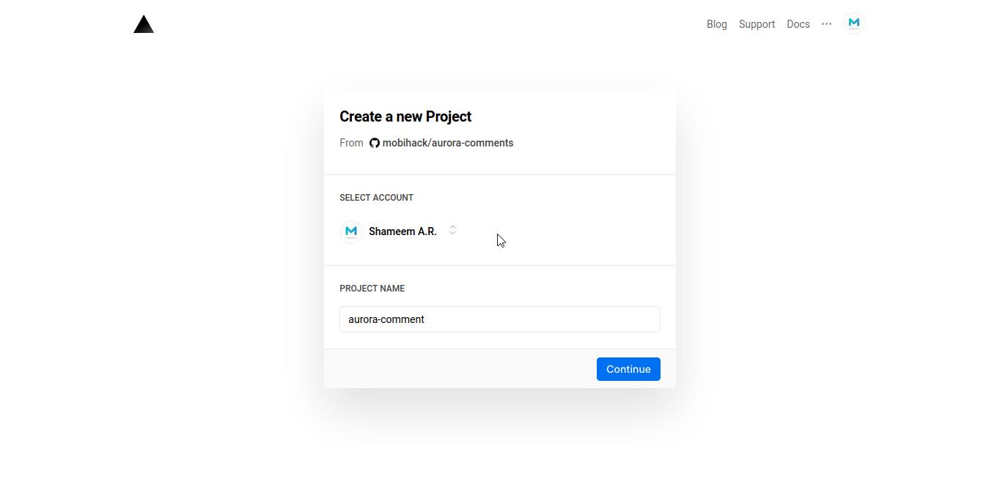

# Aurora Comment

> A now.sh ready Github based commenting system.

## Features
 - Static Comments.
 - Multiple website setup.
 - Nested comments.
 - reCaptcha

## Prerequisite

 - [`now-cli`](https://zeit.co/download)
 - [Github Personal Access Token](https://github.com/settings/tokens)
 - [Recaptcha Keys](https://www.google.com/recaptcha/)

## Installation

You can deploy Aurora Comments in two ways:
 1) Deploy directly to `now.sh`.
    - Use this if what you only need is a comments system. 
 2) Setup a development setup and deploy to `now.sh`.
    - Use this if what you need a locally hosted version.
    - Use this if you are making changes to source code.
  
Installation using both ways need the tokens to be set as [secrets](https://zeit.co/docs/v2/environment-variables-and-secrets).

Add Github Personal Access Token:
```sh
 now secrets add GITHUB_TOKEN <YOUR_GITHUB_TOKEN>
 ```
Add reCaptcha Secret Key:
 ```sh
 now secrets add RECAPTCHA_SECRET_TOKEN <YOUR_RECAPTCHA_SECRET_TOKEN>
 ```

### Deploy directly to `now.sh`

[](https://zeit.co/new/project?template=https://github.com/mobihack/aurora-comments/)



Make sure to create a fork of the repository. The repository being private or public doesn't matter.

### Development setup and deploy to `now.sh`

1) Clone this repository.

 ```sh
 git clone https://github.com/mobihack/aurora-comments.git
 ```

2) Rename `.env.sample` to `.env`.
3) Edit `.env`.
 - Add your Github Personal Access Token.
 - Add your reCaptcha secret key.
 4) Edit config.js and add your reCaptcha site key.

## Configurations (config.js)
```js

module.exports = {
  token: process.env.GITHUB_TOKEN,
  repos: {
    'example': { // your sitename
      repo: 'user/repo_name', // your repository name
      repo_docs: false,
      nested_replies: true, // set true to enable nested replies for this site
      captcha_status: true  // set true to enable captcha for this site
    }
  },
  domains: [
    /* CORS - Allowed domain list */
    'http://localhost:4000',
    'https://example.com',
    'https://beta.example.com',
    'https://example.github.io'
  ],
  captcha: {
    secret: process.env.RECAPTCHA_SECRET_TOKEN,
    site: '<YOUR_RECAPTCHA_SITE_KEY>' // Your reCaptcha site key.
  },
  commit_message: 'Sync Comments.' // Commit Message for push operation.
}

```

## Development Setup

Use this example to start a development instance.

```sh
now dev
```

Tokens will be read from `.env` file.

## Production Setup

Use this example to push code to production.

```sh
now --prod
```

Secrets must be set in advance.

## API Outputs

All API transactions will have an output of this format.

```json
{
 "success": true,
 "code": "success"
}
```
```json
{
 "success": false,
 "code": "error-code",
 "message": "Error message, if any."
}
```
### API `success`

True if the transaction was successful, false if not.

### API `code`
| Output               | Description                                    |
| -------------------- | ---------------------------------------------- |
| insufficient-inputs  | Inputs needed were not supplied.               |
| recaptcha-error      | reCaptcha error.                               |
| repo-not-configured  | The named site was not found in `config.repo`  |
| repo-not-specified   | A named site was not sent in the POST params.  |
| success              | OK / Success.                                  |

## FAQ
Some Frequently Asked Questions and their answers.

### How can I use this with Jekyll or any static?
The goal of Aurora is only to provide endpoints to easily allow comments in a static website. The client side of the code could change according to their own use. So it is upto their own self to create the client side script. Please check [Example](./tree/master/docs/_include/comments.html) to see a simple implementation using `XMLHttpRequest` and DOM Manipulation.

### Do you have plans for a standard client library?
Yes, I do have. But an ETA is not available.

### Why `now.sh`?
`now.sh` is an easy to deploy tool with a free plan that can easily handle our workload.

## Contributing

You're more than welcome to contribute to the project :heart:

To contribute:

1. Fork the repo.
2. Create your feature branch (`git checkout -b feature/fooBar`)
3. Use [Development Server](#development-setup) to check changes.
3. Commit your changes (`git commit -am 'Add some fooBar'`)
4. Push to the branch (`git push origin feature/fooBar`)
5. Create a new pull request.


Thank you!

## License

This project is licensed under the MIT License - see the [LICENSE](LICENSE) file for details

## Donation
If this project help you reduce time to develop, you can give me a cup of coffee :) 

[](https://www.paypal.com/cgi-bin/webscr?cmd=_s-xclick&hosted_button_id=EKLDUBPHHLRE4&source=url)

